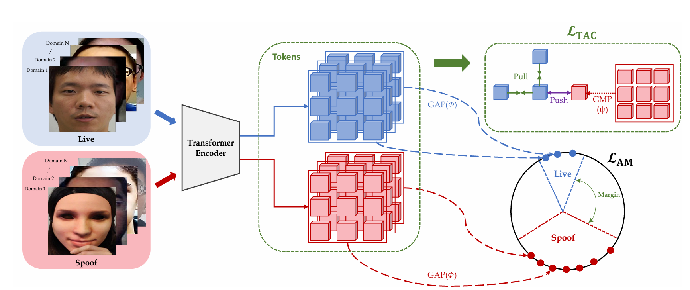
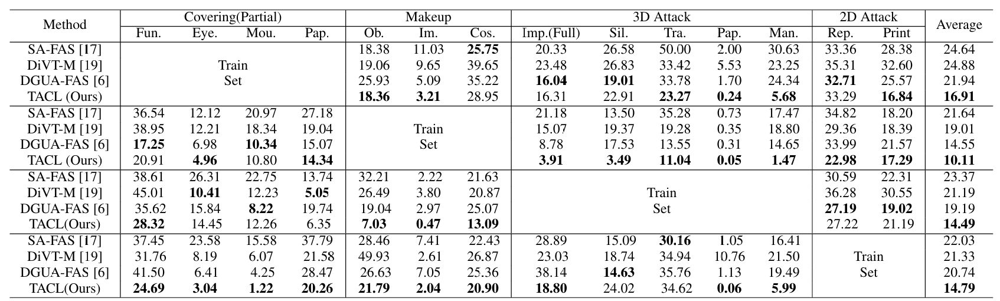
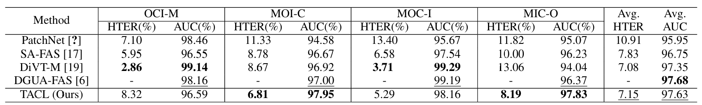

# Jump-up
# 국립한밭대학교 컴퓨터공학과 AIMLAB팀

**팀 구성**
- 30231212 민지민
- 20191766 김동수
- 20211915 오서연
- 20191785 이지상
- 20191735 서형원

## Project Background
- 필요성
  - 얼굴 인식 시스템은 사용자 인증 및 모니터링 목적은 활용성이 높음.
  - 얼굴 인식 시장 규모는 2032년까지 약 190억불로 성장할 것으로 예측됨.
  - 얼굴 인식 시스템은 위변조된 얼굴 데이터를 사용해 인식 시스템을 속이는 스푸핑 공격에 대한 방어가 필요.
  - 스푸핑 시도에 대해 인증을 허용하는 문제를 대응하고 얼굴 인식 보안성을 향상 시킬 수 있음.
    
- 목표 및 기대효과
  - 얼굴 인식 시스템의 취약점인 스푸핑 공격 탐지 기술을 개발하여 보안성 강화하는 것이 목표
  - 얼굴 안티스푸핑 기술의 향상된 보안성과 정확도는 생체인식 기술 시장의 성장을 가속화

## System Model
- 모델 전체 구조

- Token-wise Asymmetric Contrastive Loss
  - ㅇ
  - 

    
<strong>Token-wise Asymmetric Contrastive Loss (TAC Loss):</strong>

    

        LTAC = (1 / NT) &Sigma;i&isin;L, t&isin;T Li,tTAC, 
        Li,tTAC = - (1 / NT) &Sigma;j&isin;L, q&isin;T log 
        [ exp(zit &middot; zjq / &tau;) / (nl + &gamma; &middot; nf) ], 
        nl = &Sigma;k&isin;L, o&isin;T exp(zit &middot; zko / &tau;), 
        nf = &Sigma;s&isin;S exp(zit &middot; &psi;(z*s) / &tau;), 
        &psi;(z*s) = Aggregation Function (e.g., Global Max Pooling).
    

- Angular Margin Loss(AM Loss)
  - d
     
- Single-category-to-unknown-attacks
  - 기존 얼굴 안티스푸핑 분야에서 시도되지 않은 프로토콜 제안
  -  
## Numerical Results
- ABCD

## Conclusion
- ABCD

