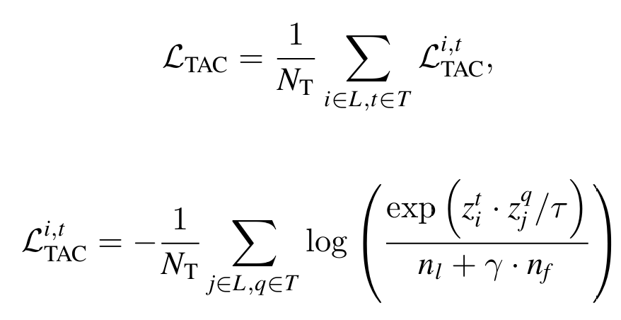
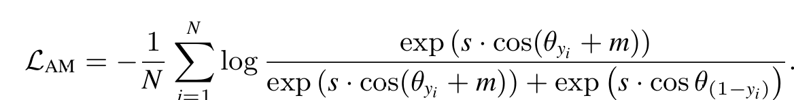

# Jump-up
# 국립한밭대학교 컴퓨터공학과 AIMLAB팀

**팀 구성**
- 30231212 민지민
- 20191766 김동수
- 20211915 오서연
- 20191785 이지상
- 20191735 서형원

## Project Background
- 필요성
  - 얼굴 인식 시스템은 사용자 인증 및 모니터링 목적으로 활용성이 높음.
  - 얼굴 인식 시장 규모는 2032년까지 약 190억불로 성장할 것으로 예측됨.
  - 얼굴 인식 시스템은 위변조된 얼굴 데이터를 사용해 인식 시스템을 속이는 스푸핑 공격에 대한 방어가 필요.
  - 스푸핑 시도에 대해 인증을 허용하는 문제를 대응하고 얼굴 인식 보안성을 향상 시킬 수 있음.
    
- 목표 및 기대효과
  - 얼굴 인식 시스템의 취약점인 스푸핑 공격 탐지 기술을 개발하여 보안성 강화하는 것이 목표.
  - 얼굴 안티스푸핑 기술의 향상된 보안성과 정확도는 생체인식 기술 시장의 성장을 가속화.

## System Model
- 모델 전체 구조

- Token-wise Asymmetric Contrastive Loss(TAC Loss)
  - live 특징 간에는 (live-live) 유사도를 최대화하여 서로 끌어당기고, spoof 특징(live-spoof)과는 거리를 증가시킴.
  - live 특징들은 live 특징을 중심으로 서로 밀집되고, spoof 특징은 더 다양한 분포를 가지도록 학습.
  - 학습하지 않은 공격에 대한 모델의 일반화 성능 향상.
 

- Angular Margin Loss(AM Loss)
  - live, spoof 특징 사이의 각도를 최대화함으로써 결정 경계를 강화.
  - 새로운 spoof 공격 유형에 대한 일반화 성능 향상.
  
     
- Single-category-to-unknown-attacks
  - 기존 얼굴 안티스푸핑 분야에서 시도되지 않은 프로토콜 제안
  - 기존 프로토콜의 한계
    - 기존 leave-one-out 프로토콜은 특정 공격 유형 하나를 제외하고 학습한 후, 이를 테스트 데이터로 사용.
    - 이러한 방식은 단일 공격 유형에 대한 모델의 일반화 성능만 평가하기 때문에, 실제 환경에서 직면하는 다양한 공격 상황을 반영하지 못하는 한계.
  - 학습하지 않은 다른 카테고리의 공격 유형에 대해 테스트를 수행.
  - 예를 들어, "2D Attack"으로 학습한 모델은 "3D Attack", "Mackeup", "Covering(Partial)" 등으로 테스트.
  - 여러 공격 유형에 대해 동시에 모델의 일반화 성능을 평가함으로써, 실제 배포 가능한 FAS 시스템을 평가하는 데 적합.
    
## Numerical Results
- Table 1
  - 제안한 Single-category-to-unknown-attacks 프로토콜에 대해 최신 기법과 비교 실험 진행 

- Table 2
  - 기존 프로토콜에 대해 최신 기법과 비교 실험 진행

## Conclusion
- 제안하는 모델이 다양한 공격 유형 및 도메인에 대해 강력한 일반화 능력을 가진 모델임을 입증하였으며, 실제 환경에서의 적용 가능성을 크게 높였음을 확인.
- 얼굴 인식 시스템의 보안성을 크게 향상시킬 수 있음을 보여주며, 스푸핑 공격에 대한 강건한 방어 체계를 구축하는 데 기여.
